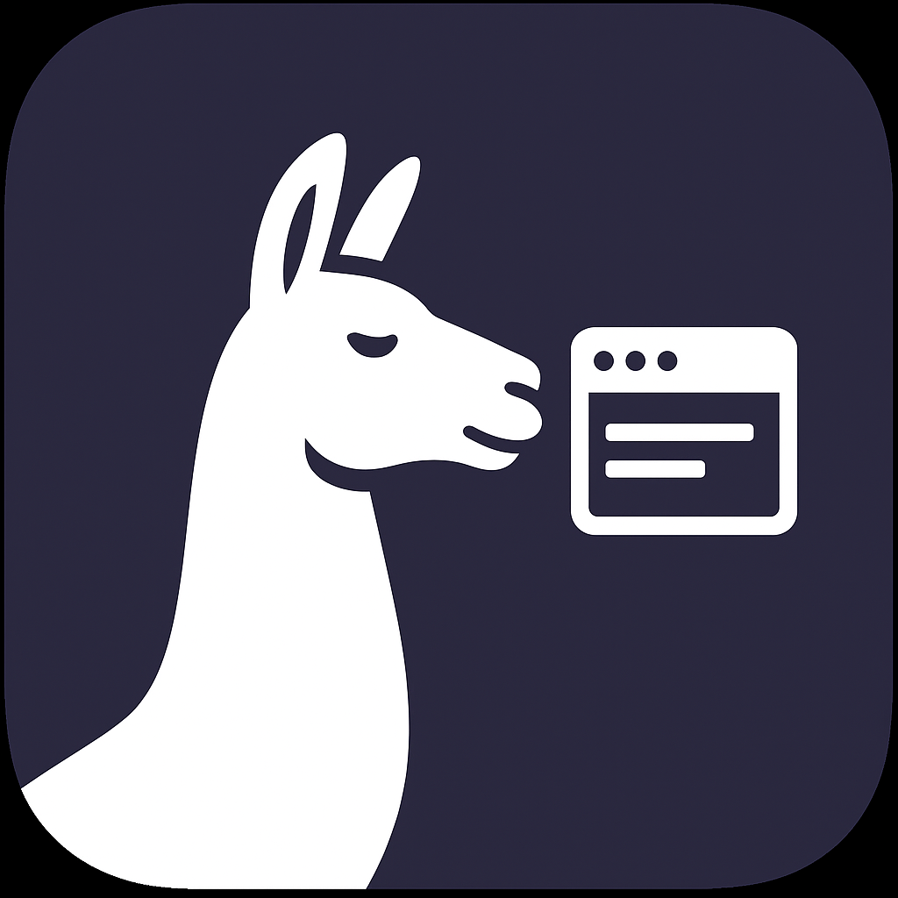

# 🦙 Unlimited Llama - AI Desktop Assistant

<div align="center">



**Un assistente AI desktop completo con chat, ricerca web, sintesi vocale e OCR**

[](https://www.python.org/)
[](LICENSE)
[](https://www.microsoft.com/windows)
[](https://opensource.org/)

</div>

## ✨ Caratteristiche

- 💬 **Chat intelligente** con modelli GGUF locali
- 🌐 **Ricerca web integrata** per informazioni aggiornate
- 🔊 **Sintesi vocale** (TTS) e riconoscimento vocale (STT)
- 📷 **OCR** per estrarre testo da immagini
- 💾 **Gestione sessioni** avanzata
- 🎛️ **Supporta qualsiasi dimensione modello LLM**
- 🔌 **API server** compatibile con OpenAI
- 📤 **Esportazione** in JSON, TXT e Markdown

## 📦 Download

### Versione Portable (Raccomandata)
[](https://drive.google.com/file/d/1klw_VJO8c7LVoARuPcEVAJEiLK2dUllt/view?usp=sharing)


🚀 Guida Rapida
Primo Avvio
Carica un modello: Vai in 🤖 Modello → 📁 Carica Modello

Inizia a chattare: Scrivi nel box in basso e premi Invio

Salva sessioni: Le conversazioni si salvano automaticamente

Funzionalità Principali
🔍 Ricerca Web
Attiva/disattiva con il toggle 🌐 Ricerca Web

Funziona automaticamente per domande su notizie, informazioni recenti, locali

Mostra le fonti utilizzate

🔊 Sintesi Vocale
Attiva con 🔊 TTS nella sidebar

L'assistente legge le risposte ad alta voce

Usa 🔇 STOP per interrompere

🎤 Riconoscimento Vocale
🎤 per input vocale singolo

🎤 Inizia Ascolto per modalità continuativa

📷 OCR da Immagini
Clicca 📷 OCR da Immagine

Seleziona un'immagine (PNG, JPG, etc.)

Il testo estratto viene inserito automaticamente nella chat

🛠️ Risoluzione Problemi
❌ "Modello non trovato"
Assicurati che il file GGUF sia nella cartella models/

Verifica che il modello sia in formato GGUF

Controlla che ci sia spazio su disco sufficiente

❌ "Tesseract non trovato"
Installa Tesseract OCR seguendo le istruzioni sopra

Riavvia l'applicazione dopo l'installazione


## ⚙️ Requisiti di Sistema

### Minimi
- **OS**: Windows 10/11, macOS 10.15+, Linux (Ubuntu 18.04+)
- **RAM**: 8 GB (16 GB raccomandati)
- **Spazio disco**: 2 GB + spazio per i modelli
- **CPU**: Processore 64-bit moderno

### Raccomandati
- **RAM**: 16 GB+ per modelli grandi
- **GPU**: NVIDIA/AMD con supporto CUDA/Metal (opzionale)
- **Spazio**: 10 GB+ per modelli di grandi dimensioni

## 🔧 Installazione

### 1. Installazione di Tesseract OCR (Obbligatorio per OCR)

#### Windows
```bash
# Usando Chocolatey (raccomandato)
choco install tesseract

# O scarica da: https://github.com/UB-Mannheim/tesseract/wiki


